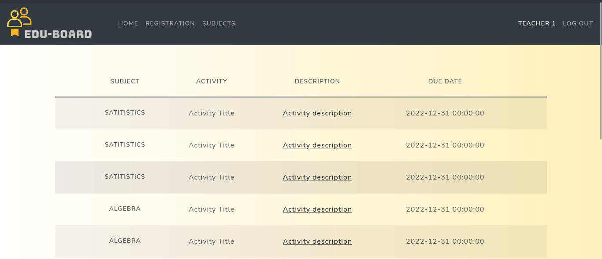
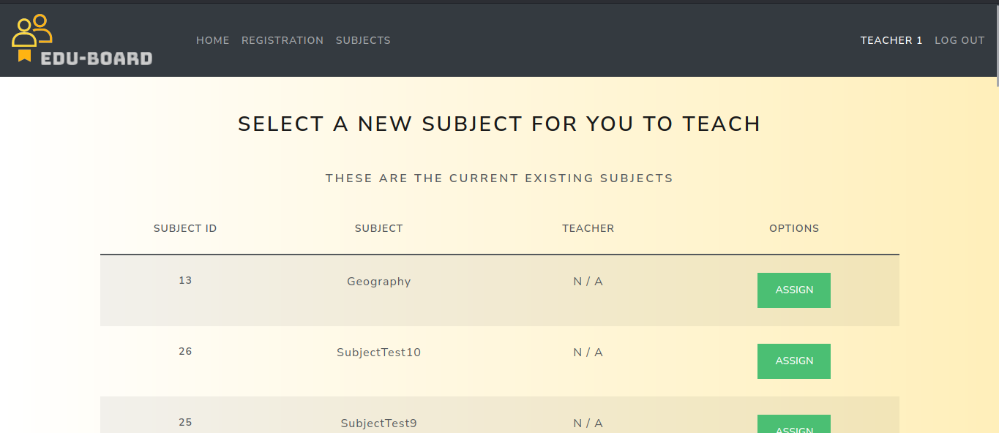
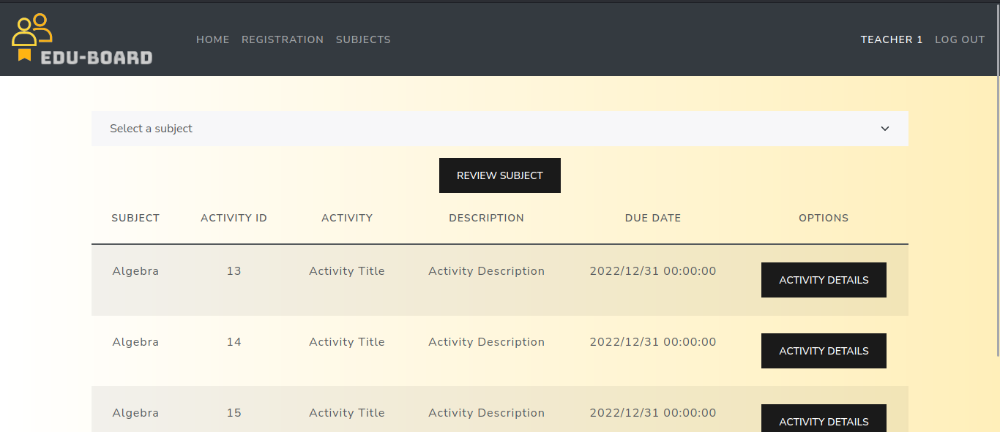
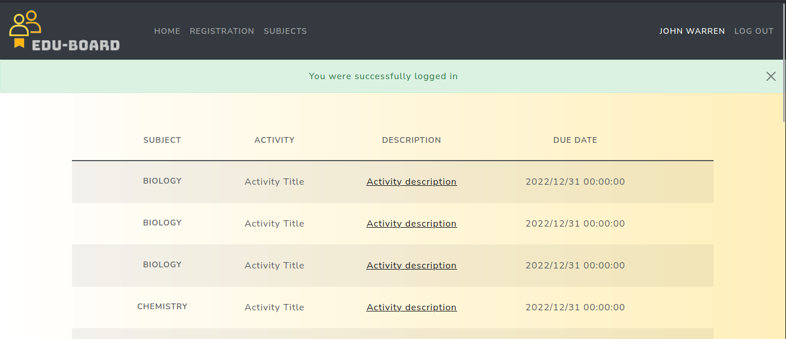
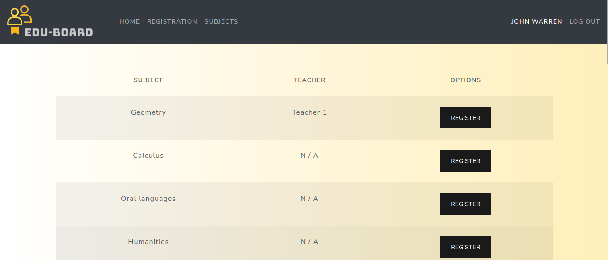
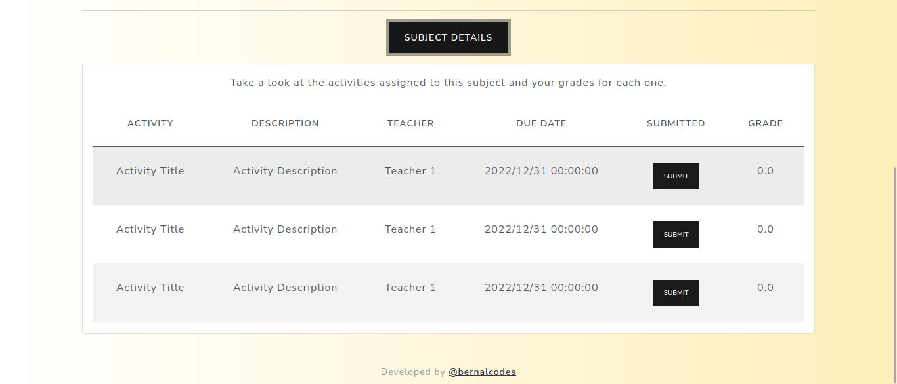

# EDU-BOARD

#### Video Demo: https://youtu.be/S704_t_25yk

#### Description:

## Edu-Board is a platform that serves as a dashboard for student-teacher interaction
***
Edu-Board provides a space for users that are either teachers or students. This project is an attempt at creating an intuitive, simple yet functional academic platform for schools around the world. In Edu-Board, users can manage their academic information, grade-wise, to be on top of any update regarding their performance on the matter, from both sides of the equation.

## How does it work?
***
Edu-Board can be hosted on your serve as a **Flask Application**. Within the project files you'll find everything you need to have your own instance of Edu-Board running in your local server. You can make use of, or even fork and modify the project yourself to suit your specific needs.

### Application configuration
***
The main information regardin the app's configuration is provided within the [`app_config.py` file](./app_config.py) which contains the information specific to the app's instance. This is the file you'll have to modify according to the specfics of the server where you'd be hosting the app.

### Information storage
***
Edu-Board stores the users' information in a **MySQL Database**, the corresponding design and structure of the database is provided in the [`.schema` file](./schema.sql), plus some SQL queries that were used throughout the creation and testing of the app. The queries provided will be of use if you decide to host your own instance  of Edu-Board.

### App initialization
***
Being a Flask application, you must configure the following variables in order for your instance to run smoothly:

`export FLASK_APP=app # (the name of the main file, in this case` [`app.py`](./app.py)`)`

`export FLASK_ENV=development  # (for changes and testing)`

`flask run # (within the directory where the project files are stored)`

## Become a user

### Teacher
***
1. Go to the **_Register_** tab and create a new user (password must be at least 8 characters long, including one uppercase, numbers and special characters)
2. Log in with your newly created user
3. On the **_Registration_** tab you'll be able to assign one or multiple subjects to your user.
4. YOu can assign a subject by clicking the `'assign'` button in green. Unavailable subjects will appear in red.
5. On the **_Subjects_** tab you'll be able to see the details of each one of your subjects, including grading the students who registered for that subject.
6. You'll have to select a subject, then click `'review subject'`. Then, you'll be able to review the activities assigned to the subject so far.
7. When you click `'activity details'` you'll be redirected to a page that'll show the current submission status per student of said activity.
8. Only students who have submitted the activity will be enabled to be graded. 

_Optional: If you click your name, you'll find information about your user._

### Student
***
1. Go to the **_Register_** tab and create a new user (password must be at least 8 characters long, including one uppercase, numbers and special characters)
2. Log in with your newly created user
3. On the **_Registration_** tab you'll be able to assign one or multiple subjects to your user.
4. You can assign a subject by clicking on the `'register'` button next to the teacher's name.
5. On the **_Subjects_** tab you'll be able to see the details of each one of your subjects, including submitting one or multiple of the activities scheduled for the subject, and review the grade for each activity.
6. You'll have to select a subject, then click `'review subject'`
7. When you click `'subject details'` you'll be able to review each activity assigned to the subject
8. If you click `'submit'`, the activity will be marked as submitted and your teacher will be able to grade it.

_Optional: If you click your name, you'll find information about your user._

### Optional: Admin/Root user
***
There's a special role for admin users. You'll have to create the user directly on your database with the role `'admin'`. This user has access to every subject and activity registered in the database.

It's up to you if you want to create new endpoints or routes for this specific role where you can either review, or even modify, the information stored in the database directly from the platform's interface.

### Optional: test data for database
***
In the directory [`db_data`](./db_data/) are stored text files that you can load in your database in case you want to test t

## Screen captures of the application

### Teacher homepage
***

    

### Teacher registration
***

    

### Teacher subject review
***

    

### Student homepage
***

    

### Student registration
***

    

### Student subject review
***

    

